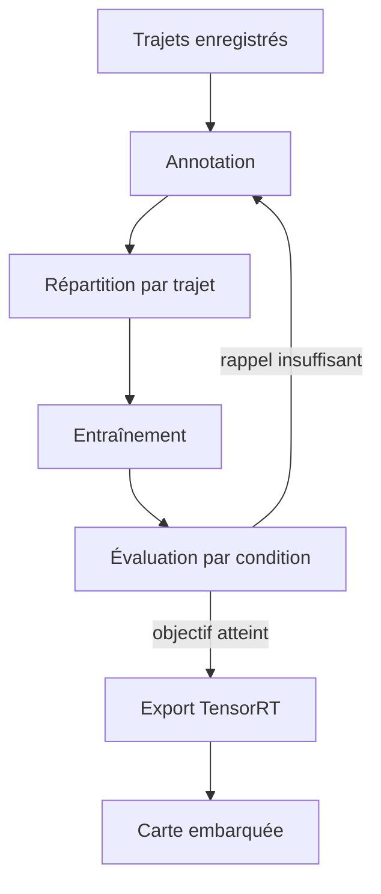

Un système d'aide à la conduite n'a pas droit à la moyenne : un piéton manqué de nuit compte plus que cent voitures bien détectées en plein jour. Ce retour d'expérience décrit la démarche suivie pour RoadSense, de l'annotation au détecteur qui tourne en 31 ms sur une carte embarquée.

## La chaîne complète



La flèche de retour vers l'annotation est la plus utile du schéma : chaque évaluation décevante a été corrigée par des données, presque jamais par l'architecture du modèle.

## Mesurer juste

Une détection est correcte si sa boîte recouvre assez la boîte annotée. Le recouvrement se mesure par l'intersection sur l'union :

$$
\mathrm{IoU}(A, B) = \frac{|A \cap B|}{|A \cup B|}
$$

Avec un seuil de 0,5, la précision moyenne d'une classe est l'aire sous sa courbe précision-rappel, et la mAP est la moyenne sur les $C$ classes :

$$
\mathrm{mAP} = \frac{1}{C} \sum_{c=1}^{C} \int_0^1 p_c(r)\, dr
$$

La mAP globale masque pourtant l'essentiel. Nous suivions donc aussi le rappel des piétons **par condition** : jour, nuit, pluie.

## Supprimer les doublons

Le détecteur propose plusieurs boîtes par objet. La suppression des non-maxima garde la meilleure et retire celles qui la recouvrent trop :

```python
import torch

def nms(boxes: torch.Tensor, scores: torch.Tensor, threshold: float = 0.5) -> list[int]:
    """Indices des boîtes gardées, de la plus sûre à la moins sûre."""
    order = scores.argsort(descending=True)
    kept: list[int] = []
    while order.numel() > 0:
        best = order[0].item()
        kept.append(best)
        if order.numel() == 1:
            break
        overlap = box_iou(boxes[best].unsqueeze(0), boxes[order[1:]]).squeeze(0)
        order = order[1:][overlap <= threshold]
    return kept
```

En production, la version de TorchVision ou de TensorRT remplace cette fonction, mais l'écrire une fois aide à comprendre pourquoi deux piétons proches disparaissent parfois en un seul.

## Résultats


| Condition | Images de test | Rappel piétons | Précision piétons |
|---|---|---|---|
| Jour | 3 200 | 0,94 | 0,91 |
| Nuit | 1 450 | 0,86 | 0,88 |
| Pluie | 820 | 0,89 | 0,87 |
| **Ensemble** | **5 470** | **0,90** | **0,89** |

Le rappel de nuit est passé de 0,71 à 0,86 en ajoutant 6 000 images nocturnes, sans changer le modèle.


## Sur la carte embarquée

| Format | Latence moyenne | mAP@0,5 |
|---|---|---|
| PyTorch FP32 (poste) | 18 ms | 0,873 |
| TensorRT FP16 (Jetson Orin) | 31 ms | 0,871 |
| TensorRT INT8 (Jetson Orin) | 19 ms | 0,842 |

Nous avons gardé FP16 : 12 ms gagnées ne valaient pas trois points de mAP sur les piétons.

## Leçons

- répartir les images **par trajet**, sinon des images presque identiques se retrouvent dans l'entraînement et le test ;
- évaluer par condition, pas seulement en moyenne ;
- mesurer la latence sur la cible, avec le prétraitement compris.
