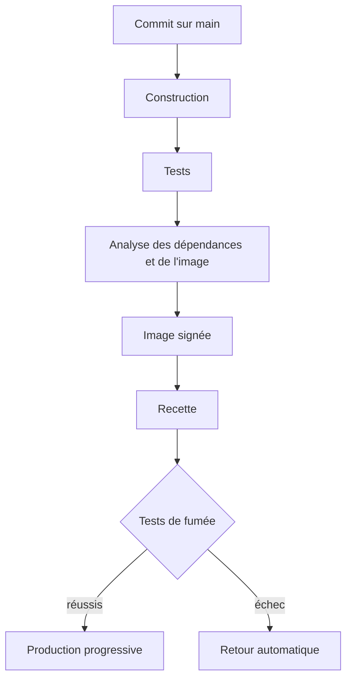

Livrer souvent n'est pas une question de courage : c'est une question de coût. Quand une mise en production prend dix minutes et se défait en une, on livre de petites modifications, et les petites modifications cassent rarement. Voici le pipeline qui sert DocuAPI et l'ERP Atlas.

## Vue d'ensemble




## Le fichier du pipeline

Le pipeline tient en un fichier versionné avec le code. Les étapes lentes tournent en parallèle et le cache Maven est partagé entre les exécutions :

```yaml
name: livraison
on:
  push:
    branches: [main]
jobs:
  build:
    runs-on: ubuntu-latest
    steps:
      - uses: actions/checkout@v4
      - uses: actions/setup-java@v4
        with:
          distribution: temurin
          java-version: '25'
          cache: maven
      - run: ./mvnw -B verify
      - run: docker build -t ghcr.io/atlas/docuapi:${{ github.run_number }} backend
  deploy-staging:
    needs: build
    environment: recette
    steps:
      - run: ./scripts/deploy.sh recette ${{ github.run_number }}
```

## Déployer et revenir en arrière

Le déploiement remplace les instances une à une et attend qu'elles soient prêtes ; le retour arrière est la même commande avec la version précédente :

```bash
kubectl set image deployment/docuapi api=ghcr.io/atlas/docuapi:1832
kubectl rollout status deployment/docuapi --timeout=120s

# En cas de problème : la version précédente, sans reconstruire
kubectl rollout undo deployment/docuapi
```

## Comparatif des stratégies

| Stratégie | Interruption | Retour arrière | Coût en ressources | Retenue |
|---|---|---|---|---|
| Recréation | oui | lent | faible | non |
| Remplacement progressif | non | rapide | faible | **oui** |
| Bleu-vert | non | immédiat | double | pour la base de données seulement |
| Canari | non | immédiat | modéré | prévu en 2027 |

## Superviser ce qu'on livre

Un déploiement n'est terminé que lorsque les indicateurs restent bons dix minutes après. Le tableau de bord compare la latence et le taux d'erreurs avant et après chaque version :


## Ce que cela a changé

- 4 déploiements par semaine au lieu d'un par mois ;
- durée médiane d'un incident : 12 minutes, retour arrière compris ;
- plus aucun « gel des livraisons » avant les congés.
