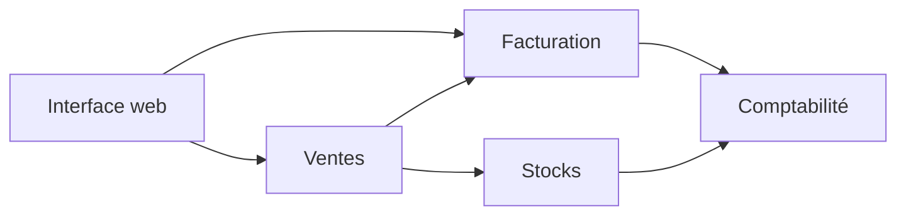

Un monolithe n'est pas un défaut de conception : c'est un choix de déploiement. Ce qui rend un monolithe pénible, ce sont les dépendances que personne n'a décidées. Cet article décrit comment l'ERP Atlas garde neuf modules indépendants dans un seul processus Spring Boot, et comment les tests empêchent les frontières de s'effacer.

## Architecture

Chaque module possède son modèle, ses cas d'usage et ses tables. Un module n'en appelle un autre que par ses services applicatifs : jamais par son dépôt, jamais par ses entités.



Le sens des flèches est la règle la plus importante du projet : une dépendance qui remonte (la comptabilité qui appellerait les ventes) crée un cycle, et un cycle fait de deux modules un seul.

## Exemple

Les frontières sont vérifiées à chaque build par ArchUnit. Le test échoue avant même que la revue de code ne commence :

```java
@Test
void modules_only_use_each_other_through_application_services() {
    for (String module : List.of("ventes", "facturation", "stocks", "comptabilite")) {
        noClasses()
            .that().resideOutsideOfPackage(BASE + "." + module + "..")
            .should().dependOnClassesThat().resideInAnyPackage(
                BASE + "." + module + ".domain.port..",
                BASE + "." + module + ".infrastructure..")
            .check(classes);
    }
}
```

Un cas d'usage reste petit et transactionnel ; il ne connaît que des ports :

```java
@Service
@RequiredArgsConstructor
public class IssueInvoiceUseCase {

    private final InvoiceRepository invoices;
    private final AccountingService accounting;

    @Transactional
    public Invoice execute(InvoiceDraft draft) {
        Invoice invoice = invoices.create(Invoice.issue(draft));
        accounting.recordSale(invoice.toSaleEntry());
        return invoice;
    }
}
```

## Contrat d'API

Le contrat OpenAPI est généré depuis le code, puis comparé à la version publiée dans le dépôt. Une propriété ajoutée sans être documentée fait échouer le build ; le frontend régénère ses types depuis ce même fichier.


## Résultats

Après dix-huit mois, les chiffres donnent raison au monolithe :

| Mesure | Valeur |
|---|---|
| Modules | 9 |
| Dépendances circulaires | 0 (vérifié à chaque build) |
| Durée du build complet | 6 min 40 |
| Déploiements par semaine | 4 en moyenne |
| Incidents liés à un déploiement | 1 en 2025 |

La seule vraie limite rencontrée : le temps de démarrage, passé de 9 à 14 secondes. Il se règle par l'initialisation paresseuse de deux modules rarement utilisés, pas par un découpage en services.

## À retenir

- une frontière non testée finit toujours par céder ;
- les modules communiquent par des services applicatifs, jamais par leurs tables ;
- le contrat d'API se génère et se vérifie, il ne se maintient pas à la main.
