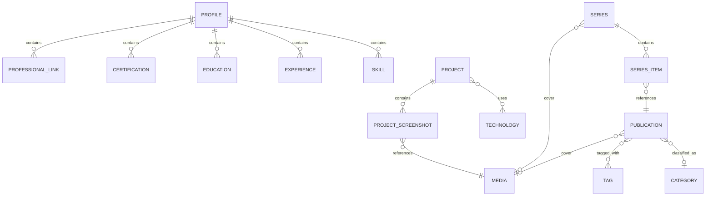

# Modèle métier V1 — Portfolio

## 1. Objectif

Ce document décrit le modèle métier conceptuel de la V1.

Il définit :

* les concepts ;
* leurs responsabilités ;
* leurs relations ;
* leurs cardinalités ;
* leurs cycles de vie ;
* leurs invariants.

Il ne définit pas encore :

* les tables PostgreSQL ;
* les annotations JPA ;
* les DTO ;
* les endpoints REST ;
* les migrations Flyway.

---

# 2. Vue globale

```text
Profile
├── Skill
├── Experience
├── Education
├── Certification
└── ProfessionalLink

Project
├── Technology
└── ProjectScreenshot

Publication
├── Category
├── Tag
└── Media

Series
└── SeriesItem

Media

ContactMessage

AdminAccount
```

---

# 3. Racines d'agrégat

Racines principales :

```text
Profile
Project
Publication
Series
Category
Tag
Technology
Media
ContactMessage
AdminAccount
```

Éléments composés :

```text
Skill
Experience
Education
Certification
ProfessionalLink
ProjectScreenshot
SeriesItem
```

Les éléments composés ne possèdent pas d'API métier autonome.

---

# 4. Profile

`Profile` représente le propriétaire professionnel du portfolio.

La V1 contient un seul profil.

```text
Profile
├── displayName
├── professionalTitle
├── shortBio
├── aboutMarkdown
├── publicLocation
├── publicEmail
├── avatarMedia
└── cvMedia
```

Relations :

```text
Profile 1 → 0..* Skill
Profile 1 → 0..* Experience
Profile 1 → 0..* Education
Profile 1 → 0..* Certification
Profile 1 → 0..* ProfessionalLink
```

État d’implémentation (étapes 14 à 16 et 27.3) : tous les attributs et collections ci-dessus. `avatarMedia` (une image) et `cvMedia` (un PDF, D06) sont facultatifs : des références vers le catalogue `Media` (D-BX).

---

# 5. Skill

```text
Skill
├── name
├── category
└── displayOrder
```

Aucun niveau `BEGINNER/EXPERT` n'est imposé dans la V1.

---

# 6. Experience

```text
Experience
├── organization
├── title
├── location
├── startDate
├── endDate?
├── description
└── displayOrder
```

`endDate = null` signifie que l'expérience est en cours.

---

# 7. Education

```text
Education
├── institution
├── degree
├── field
├── location
├── startDate
├── endDate?
├── description
└── displayOrder
```

---

# 8. Certification

```text
Certification
├── name
├── issuer
├── issuedAt
├── expiresAt?
├── credentialUrl?
└── displayOrder
```

---

# 9. ProfessionalLink

```text
ProfessionalLink
├── label
├── url
└── displayOrder
```

Il est composé dans `Profile`.

Il n'existe pas indépendamment du profil.

---

# 10. Project

```text
Project
├── title
├── slug
├── shortDescription
├── descriptionMarkdown
├── stage
├── visibility
├── startDate
├── endDate?
├── repositoryUrl?
├── demoUrl?
├── coverMedia?
├── featured
└── displayOrder
```

## ProjectStage

```text
IN_PROGRESS
COMPLETED
```

`stage` est cohérent avec la période : `IN_PROGRESS` si et seulement si `endDate` est absente (invariant 21, ajouté à l’étape 17, D-T). Il reste indépendant de la visibilité (D19).

## ProjectVisibility

```text
DRAFT
PUBLISHED
ARCHIVED
```

Seul un projet `PUBLISHED` est exposé publiquement.

État d’implémentation (étapes 17, 18 et 27.2) : tous les attributs ci-dessus, les technologies, la couverture et les captures (`ProjectScreenshot`, références vers le catalogue `Media`, D-BV). Le slug est unique et au format kebab-case, garanti par PostgreSQL (D-X).

---

# 11. Technology

`Technology` représente le vocabulaire technique utilisé par les projets.

```text
Technology
├── name
├── slug
└── displayOrder
```

Relation :

```text
Project N ↔ N Technology
```

Exemples :

```text
Java
Spring Boot
Angular
PostgreSQL
Docker
PyTorch
```

`Technology` est distinct de `Tag`.

État d’implémentation (étape 18) : module `project`, tables `technology` et `project_technology`. Les technologies d’un projet sont toujours présentées dans l’ordre du vocabulaire (`displayOrder`, puis nom) ; un projet n’a pas d’ordre propre pour ses technologies (D-Z).

---

# 12. ProjectScreenshot

```text
ProjectScreenshot
├── media
├── caption?
└── displayOrder
```

Relation :

```text
Project 1 → 0..* ProjectScreenshot
ProjectScreenshot N → 1 Media
```

`ProjectScreenshot` est composé dans `Project`.

La suppression d'une capture ne supprime pas automatiquement le `Media`.

État d’implémentation (étape 27.2) : une capture apparaît au plus une fois dans un projet (invariant 27) ; ordre d’affichage positif ou nul, puis identifiant du média ; légende de 300 caractères au plus. Supprimer un projet supprime ses captures, pas les médias (D-BV).

---

# 13. Publication

Une publication représente soit :

```text
ARTICLE
```

soit :

```text
NEWS
```

Structure :

```text
Publication
├── type
├── title
├── slug
├── summary
├── contentMarkdown
├── coverMedia?
├── status
├── publishedAt?
├── firstPublishedAt?
├── category?
├── tags
├── featured
├── seoTitle?
├── seoDescription?
├── createdAt
└── updatedAt
```

Le Markdown est la source canonique.

Aucun `contentHtml` métier n'est nécessaire.

État d’implémentation (étapes 19 à 22 et 27.4) : tous les attributs ci-dessus, dont `coverMedia` (référence facultative vers le catalogue `Media`, D-BY) ; le temps de lecture est calculé à partir du Markdown (D12, D-AJ). Le slug est unique pour l’ensemble des publications (D-AL). `firstPublishedAt` retient la première apparition publique : provisoire tant qu’elle est future, elle ne change plus une fois passée (D-AZ) ; elle rend le slug définitif (§16).

---

# 14. PublicationType

```text
ARTICLE
NEWS
```

`ARTICLE` peut appartenir à une série.

`NEWS` ne peut jamais appartenir à une série.

---

# 15. PublicationStatus

```text
DRAFT
IN_REVIEW
SCHEDULED
PUBLISHED
ARCHIVED
```

Règles essentielles :

```text
DRAFT
→ jamais public

IN_REVIEW
→ jamais public

SCHEDULED
→ public seulement si publishedAt <= now

PUBLISHED
→ public

ARCHIVED
→ jamais public
```

La comparaison temporelle utilise une horloge fournie par l'application et non un appel dispersé à l'heure système.

État d’implémentation (étape 19) : la visibilité est appliquée par les lectures publiques avec l’horloge applicative (D-AG, D-AH).

Transitions (étape 21, invariant 26, D-AV), évaluées sur le statut effectif — une publication `SCHEDULED` dont la date est passée est considérée comme `PUBLISHED` :

```text
DRAFT      → IN_REVIEW, SCHEDULED, PUBLISHED
IN_REVIEW  → DRAFT, SCHEDULED, PUBLISHED
SCHEDULED  → DRAFT, SCHEDULED (nouvelle date), PUBLISHED
PUBLISHED  → ARCHIVED
ARCHIVED   → DRAFT, PUBLISHED
```

Règles de date : planifier exige une date strictement future ; publier conserve une date déjà passée (restauration d’une archive), sinon date la publication à « maintenant » ; repasser en brouillon annule une planification encore future ; archiver conserve la date. Une transition refusée produit `INVALID_PUBLICATION_TRANSITION` (409).

---

# 16. Slugs

Les ressources suivantes possèdent un slug public :

```text
Project
Publication
Series
Category
Tag
Technology
```

Un slug est :

* compatible URL ;
* unique dans son espace ;
* validé côté serveur.

Après la première publication publique d'un contenu, son slug est considéré comme stable.

État d’implémentation (étape 22) : objet de valeur `Slug` partagé par les modules (D-BA). Un slug est généré depuis un titre ou un nom (« Construire une API REST avec Spring Boot » → `construire-une-api-rest-avec-spring-boot`) ; en cas de collision, le premier suffixe libre de `-2` à `-99` est retenu, la contrainte `UNIQUE` restant la garantie finale (D-BD). Une valeur d’URL mal formée est introuvable sans interroger la base (D-BB). Une publication déjà publique refuse tout changement de slug (`SLUG_LOCKED`, D-BC) ; pour les projets, la règle arrive avec leur modification (étape 36) ; les slugs des vocabulaires (technologies, catégories, tags) restent modifiables.

---

# 17. Category

```text
Category
├── name
├── slug
└── description?
```

Relation :

```text
Category 1 ← 0..* Publication
Publication → 0..1 Category
```

Une publication possède au maximum une catégorie principale.

État d’implémentation (étape 20) : module `taxonomy`, table `category` ; la publication référence sa catégorie par identifiant (`publication.category_id`, ADR 0002).

---

# 18. Tag

```text
Tag
├── name
└── slug
```

Relation :

```text
Publication N ↔ N Tag
```

Les tags sont éditoriaux.

Ils ne constituent pas le catalogue des technologies des projets.

État d’implémentation (étape 20) : module `taxonomy`, table `tag` ; association `publication_tag` possédée par le module `publication` (ADR 0002). Les tags n’ont pas d’ordre propre : ils sont présentés par ordre alphabétique.

---

# 19. Series

```text
Series
├── title
├── slug
├── descriptionMarkdown
└── coverMedia?
```

Une série ne possède pas de workflow éditorial propre dans la V1.

Elle organise des articles.

État d’implémentation (étapes 23 et 27.4) : tous les attributs ci-dessus, dont `coverMedia` (référence facultative, D-BY). Une série est publique si et seulement si au moins un de ses articles est visible ; sa table des matières ne montre que ces articles, numérotés à partir de 1 (D-BG). Lecture publique seulement : création et modification à l’étape 36 (D-BE).
Depuis l’étape 24, un article visible d’une série connaît sa position, le nombre de chapitres visibles et ses voisins visibles précédent et suivant ; un article masqué est sauté (D-BL, D-BM).

---

# 20. SeriesItem

```text
SeriesItem
├── publication
└── position
```

Relations :

```text
Series 1 → 0..* SeriesItem
SeriesItem → 1 Publication
```

Invariants :

```text
Publication.type = ARTICLE

un article appartient au maximum à une série

(series, position) est unique

position > 0
```

`SeriesItem` n'existe pas sans `Series`.

État d’implémentation (étape 23) : les positions peuvent laisser des trous, seul leur ordre compte. Supprimer un article le retire de sa série ; un article rangé dans une série ne peut pas devenir une `NEWS` (D-BF).

---

# 21. Media

```text
Media
├── storageKey
├── originalName
├── mimeType
├── size
├── width?
├── height?
├── altText?
└── createdAt
```

Formats :

```text
PNG
JPEG
WebP
PDF
```

Le domaine connaît :

```text
storageKey
```

mais pas le chemin physique utilisé par `LocalMediaStorage`.

État d’implémentation (étape 25) : `StorageKey` (UUID aléatoire et extension du format, D-BP) et lecture publique d’un fichier par sa clé ; les autres attributs (catalogue) arrivent à l’étape 27. Depuis l’étape 26, un fichier envoyé est reconnu par sa signature et limité à 5 Mio (image) ou 10 Mio (PDF) ; il reçoit une nouvelle clé (D-BR). Depuis l’étape 27.1, il est inscrit au catalogue avec tous les attributs ci-dessus ; `mimeType` se déduit de la clé, `width` et `height` sont lus dans l’en-tête et n’existent que pour une image (D-BU).

---

# 22. Suppression des médias

Un `Media` référencé ne doit pas pouvoir être supprimé silencieusement.

Flux :

```text
demande de suppression
 ↓
recherche des références
 ↓
référencé ?
 ├── oui → refus
 └── non → suppression
```

La suppression d'un :

```text
Project
Publication
Series
```

ne supprime donc pas automatiquement les médias référencés.

---

# 23. ContactMessage

```text
ContactMessage
├── name
├── email
├── subject
├── message
├── status
├── createdAt
└── updatedAt
```

Aucune adresse IP n'est persistée par défaut.

Le rate limiting est une préoccupation de sécurité de la requête, pas une propriété métier du message.

État d'implémentation (étape 30, D-CG) : nom (100 caractères), adresse (254), sujet (200) et message (5 000) obligatoires et non blancs, adresse de forme `local@domaine.tld`, espaces de début et de fin retirés à la réception ; règles du domaine doublées par PostgreSQL (`V020`). Aucune route avant l'étape 48 (envoi public protégé) et l'étape 36 (administration).

---

# 24. ContactStatus

```text
NEW
READ
PROCESSED
ARCHIVED
```

Transitions normales :

```text
NEW
 ↓
READ
 ↓
PROCESSED
 ↓
ARCHIVED
```

Implémenté à l'étape 30 (invariant 29, D-CH) : le statut n'avance que dans cet ordre, en sautant éventuellement des étapes (un message indésirable s'archive directement) ; aucun retour en arrière.

---

# 25. Notification email du contact

Flux :

```text
validation
 ↓
sauvegarde du ContactMessage
 ↓
commit réussi
 ↓
tentative de notification email
```

Une erreur SMTP ne peut pas annuler la sauvegarde.

État d'implémentation (étape 31, D-CI, D-CJ) : événement `ContactMessageReceived` traité après la validation de la transaction ; courriel texte à l'administrateur, `Reply-To` vers le visiteur ; un échec est journalisé (identifiant du message seulement) et ignoré.

La V1 ne modélise pas un historique complet de livraison d'emails.

Une telle fonctionnalité pourra devenir un sous-système séparé ultérieurement.

---

# 26. AdminAccount

```text
AdminAccount
├── login
├── passwordHash
├── enabled
├── lastLoginAt?
├── createdAt
└── updatedAt
```

Il existe un seul compte administrateur en V1.

Le modèle ne dépend pas d'un algorithme de hash précis.

Il exige seulement que le mot de passe soit stocké à travers le mécanisme sécurisé retenu par Spring Security.

---

# 27. Search

`Search` n'est pas une entité.

C'est une capacité de lecture portant sur :

```text
Publication publiquement visible
Project PUBLISHED
```

La recherche n'indexe pas :

```text
brouillons
contenus archivés
profil
messages de contact
administration
```

État d'implémentation (étape 28) : chaque `Publication` et chaque `Project` porte un document de recherche pondéré, calculé par PostgreSQL (titre et tags ou technologies, résumé ou description courte, contenu ou description : D-CA, D-CB), mais la recherche ne **renvoie** que les publications visibles et les projets `PUBLISHED`, selon les règles de leur module (invariants 7 à 11, D-CC) ; une publication planifiée devient ainsi trouvable à sa date sans écriture. Le profil, les messages de contact et l'administration n'ont pas de document.

---

# 28. Relations principales

```text
Profile
 ├── Skill *
 ├── Experience *
 ├── Education *
 ├── Certification *
 ├── ProfessionalLink *
 ├── avatar → Media ?
 └── CV → Media ?

Project
 ├── Technology *
 ├── ProjectScreenshot *
 └── cover → Media ?

ProjectScreenshot
 └── Media

Publication
 ├── Category ?
 ├── Tag *
 └── cover → Media ?

Series
 ├── SeriesItem *
 └── cover → Media ?

SeriesItem
 └── Publication ARTICLE
```

---

# 29. Diagramme conceptuel


```mermaid
erDiagram

    PROFILE ||--o{ SKILL : contains
    PROFILE ||--o{ EXPERIENCE : contains
    PROFILE ||--o{ EDUCATION : contains
    PROFILE ||--o{ CERTIFICATION : contains
    PROFILE ||--o{ PROFESSIONAL_LINK : contains

    PROJECT }o--o{ TECHNOLOGY : uses
    PROJECT ||--o{ PROJECT_SCREENSHOT : contains
    PROJECT_SCREENSHOT }o--|| MEDIA : references

    PUBLICATION }o--o| CATEGORY : classified_as
    PUBLICATION }o--o{ TAG : tagged_with
    PUBLICATION }o--o| MEDIA : cover

    SERIES ||--o{ SERIES_ITEM : contains
    SERIES_ITEM }o--|| PUBLICATION : references
    SERIES }o--o| MEDIA : cover
```

---

# 30. Invariants métier

Les règles suivantes doivent être garanties par le backend et, lorsque pertinent, renforcées par la base :

1. une `NEWS` n'appartient jamais à une série ;
2. un article appartient au maximum à une série ;
3. une position n'existe qu'une fois dans une même série ;
4. une publication possède au maximum une catégorie ;
5. un slug respecte l'unicité définie ;
6. un slug publié devient stable ;
7. `DRAFT` n'est jamais public ;
8. `IN_REVIEW` n'est jamais public ;
9. `ARCHIVED` n'est jamais public ;
10. `SCHEDULED` dépend de `publishedAt` et de l'horloge applicative ;
11. seuls les projets `PUBLISHED` sont publics ;
12. un média doit respecter les types et tailles autorisés ;
13. un média référencé ne peut pas être supprimé ;
14. un échec SMTP ne supprime jamais un message sauvegardé ;
15. le mot de passe administrateur n'est jamais stocké en clair ;
16. une entité JPA ne constitue jamais directement le contrat d'API.
17. une période (`Experience`, `Education`, `Project`) ne se termine jamais avant de commencer ; `endDate = null` signifie « en cours » ;
18. une `Certification` n'expire jamais avant sa date de délivrance ;
19. le nom d'une `Skill` est unique dans le profil ;
20. il existe au plus un `Profile` ;
21. un `Project` est `IN_PROGRESS` si et seulement s'il n'a pas de date de fin ; sa période respecte l'invariant 17 ;
22. le nom (sans tenir compte de la casse) et le slug d'une `Technology` sont uniques ; une technologie utilisée par un projet ne peut pas être supprimée ;
23. un `Project` référence au plus une fois la même `Technology` ;
24. une `Publication` `SCHEDULED`, `PUBLISHED` ou `ARCHIVED` possède toujours une date de publication (`publishedAt`) et une date de première publication (`firstPublishedAt`, jamais postérieure à `publishedAt`) — étendu à `ARCHIVED` à l’étape 21, première publication à l’étape 22 ;
25. le nom (sans tenir compte de la casse) et le slug d'une `Category`, d'un `Tag`, sont uniques dans leur vocabulaire ; un terme utilisé par une publication ne peut pas être supprimé ;
26. le statut d'une `Publication` ne change que selon la table des transitions du §15 ;
27. un `Project` référence au plus une fois le même média parmi ses captures.
28. le document de recherche d'une `Publication` (titre, tags, résumé, contenu) et d'un `Project` (titre, technologies, description courte, description) reflète toujours leur état courant, y compris après le renommage d'un tag ou d'une technologie.
29. le statut d'un `ContactMessage` n'avance que dans l'ordre `NEW → READ → PROCESSED → ARCHIVED`, sans retour en arrière (étapes sautables).

Les invariants 17 à 29 ont été ajoutés pendant l'implémentation (étapes 14 à 30) ; 27 est garanti par PostgreSQL et doublé par le modèle métier ; 28 est garanti par PostgreSQL seul (colonnes générées et déclencheurs, `V018`, `V019`, D-CA, D-CB), l'application n'écrivant jamais le document ; 29 est **applicatif** comme 26 : il tient tant que le statut d'un message n'est écrit que par `ChangeContactMessageStatusUseCase` (D-CH). Les invariants 17 à 25 sont garantis par PostgreSQL (`CHECK`, `UNIQUE`, clés étrangères) et, pour 17, 18, 21, 23 et 24, doublés par le modèle métier. L'invariant 26 (table des transitions) est **applicatif uniquement** : aucune contrainte SQL ne compare l'ancien et le nouveau statut ; il est garanti tant que le statut n'est écrit que par `ChangePublicationStatusUseCase` (seul appelant de `updateStatus`, D-AX). L'invariant 6 (slug stable) est lui aussi applicatif : `Publication.changeSlug` refuse le changement dès que `firstPublishedAt` est passée (D-BC) ; l'invariant 5 est garanti par les contraintes `UNIQUE` de PostgreSQL (D-X, D-AA, D-AL, D-AO). Les invariants 1 à 3 (séries) sont garantis par PostgreSQL depuis l'étape 23 (`V011`, D-BF) et, pour 3, doublés par le modèle métier. L'invariant 13 (média référencé non supprimable) est garanti par les clés étrangères `ON DELETE RESTRICT` des contenus vers `media`, depuis l'étape 27.2 pour les projets, 27.3 pour le profil et 27.4 pour les publications et les séries (D-BV, D-BX, D-BY). Les invariants 7 à 10 (visibilité des publications) sont appliqués par les lectures publiques depuis l'étape 19. Voir [`decisions/registre-implementation.md`](decisions/registre-implementation.md).

---

# 31. Concepts volontairement absents

La V1 ne possède pas :

```text
PublicUser
Author
Role métier multiple
Permission
Comment
Like
Reaction
NewsletterSubscriber
Payment
ArticleRevision
ViewCounter
Recommendation
Translation
EmailDeliveryHistory
```

Ils ne doivent pas apparaître « pour anticiper ».

---

# 32. Découpage backend

```text
shared/
security/
profile/
project/
publication/
series/
taxonomy/
media/
search/
contact/
```

`shared` doit contenir uniquement des primitives réellement transversales.

Il ne doit pas devenir un dossier général pour les classes mal classées.

---

# 33. Résultat

Le modèle de la V1 possède des frontières cohérentes, suffisamment de règles pour guider les migrations et aucune abstraction majeure sans besoin fonctionnel.

La traduction vers PostgreSQL/JPA pourra commencer ensuite sans modifier les décisions fonctionnelles du périmètre.
