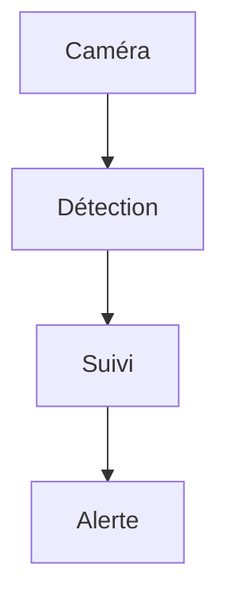

## Détecter les piétons en 31 ms

Le détecteur reçoit une image de 640 px et renvoie des boîtes avec leur score $s \in [0, 1]$.


### La mesure

La précision moyenne se calcule par classe :

$$
\mathrm{mAP} = \frac{1}{|C|} \sum_{c \in C} \mathrm{AP}_c
$$

| Mesure | Valeur |
| :--- | ---: |
| mAP@0,5 | 0,871 |
| Rappel piétons | 0,903 |
| Latence embarquée | 31 ms |

### La chaîne



```python
def nms(boxes, scores, threshold=0.5):
    order = scores.argsort()[::-1]
    return [boxes[i] for i in order if scores[i] >= threshold]
```

Le suivi multi-objets associe les détections d'une image à l'autre, avec une perte $\mathcal{L} = \lambda_1 \mathcal{L}_{box} + \lambda_2 \mathcal{L}_{cls}$.
